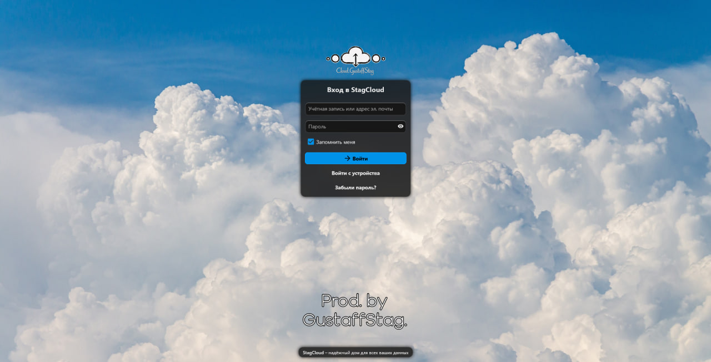

# 🖥️ Home Server

My personal home server infrastructure built and maintained by me.

This project is mainly used for self-hosting, networking experiments,
remote access and learning how server infrastructure works in practice.

---

## ⚙️ Stack

- 🐧 Linux
- 🐳 Docker
- 🔐 WireGuard
- 🎬 Jellyfin
- 🌐 Networking
- 🏠 Self-hosted services

---

## 🔧 What I did

### Server

Set up and configured my own server environment from scratch.

- Linux installation and configuration
- Server administration
- Storage and service management
- Network configuration
- Remote access

### Docker

Use Docker to deploy and manage self-hosted services.

- Container deployment
- Service configuration
- Port mapping
- Container management
- Troubleshooting

### WireGuard

Built my own VPN setup using WireGuard for secure remote access
to my home network and services.

- VPN server configuration
- Client configuration
- Key management
- Network routing
- Remote access

### Jellyfin

Self-hosted media server for managing and streaming my personal
media library across devices.

---

## 🌐 Network

Basic infrastructure:

```text
                    Internet
                       │
                       ▼
                   Home Router
                       │
              ┌────────┴────────┐
              │                 │
              ▼                 ▼
          Home Network      WireGuard VPN
              │                 │
              │                 ▼
              │           Remote Devices
              │
              ▼
          Home Server
              │
         ┌────┴────┐
         │         │
         ▼         ▼
      Docker    Other Services
         │
         ▼
      Jellyfin

---


## 🧠 What I learned

Working on this project gave me practical experience with:

Linux administration
Networking
VPNs
Docker
Self-hosting
Remote access
Troubleshooting
Service configuration

I prefer learning by building things myself and figuring out
how they work under the hood.

🚧 Status

🟢 Active

The infrastructure is continuously maintained and expanded.

## 📸 Server

Screenshot of my server environment:

! 
